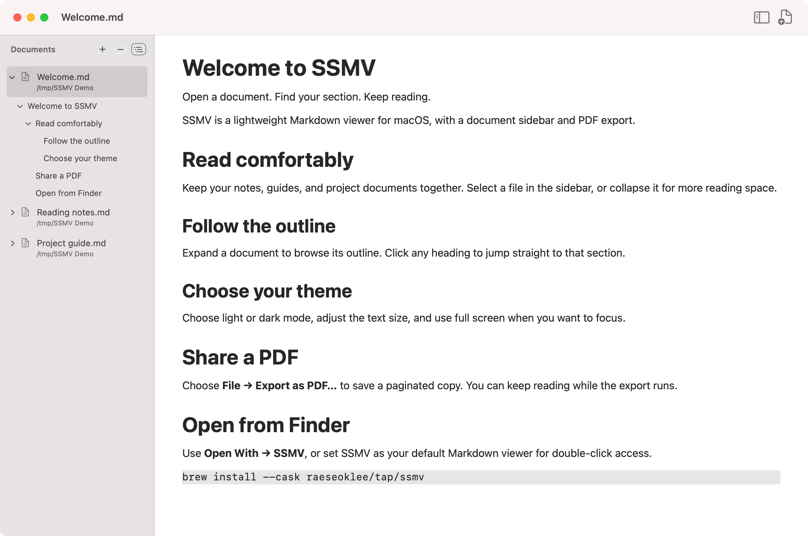

# SSMV — So Simple Markdown Viewer

[한국어](docs/README.ko.md)

SSMV is a **lightweight Markdown viewer for macOS**. Read local files, public Markdown URLs, and text from LLM tools. Navigate by heading and export to PDF.

**macOS 13+ · Apple Silicon & Intel · Free · MIT license**



## Features

- **Open straight from Finder.** Use Open With, or set SSMV as your default for double-click access.
- **Read from a URL or LLM tool.** Open public HTTPS Markdown, paste copied text, or pipe output into `ssmv`.
- **Keep documents together.** Switch files in a collapsible sidebar and navigate by heading.
- **Read comfortably.** Choose light or dark mode, adjust text size, and hide the controls in full screen.
- **Save a PDF.** Export a paginated document while continuing to read.

Built with Swift and AppKit, SSMV is read-only and uses no web view, background server, or third-party packages. See the [large-document measurements](docs/PERFORMANCE.md).

## Install

```sh
brew install --cask raeseoklee/tap/ssmv
open -a SSMV
```

Or download the Universal app for Apple Silicon and Intel from [GitHub Releases](https://github.com/raeseoklee/ssmv/releases). Unzip it and move `SSMV.app` to Applications.

**Release signing:** Version 0.5.0 is ad-hoc signed, not Developer ID signed or notarized by Apple. The Homebrew cask verifies the archive checksum and bundle signature, then removes quarantine from SSMV.app so it can launch. This bypasses Gatekeeper’s first-launch check for this app; it does not add Apple notarization. A manually downloaded copy may still be blocked. Review [Apple’s guidance for opening apps from unidentified developers](https://support.apple.com/en-gb/102445) before deciding whether to open it. You can also [build from source](#build-from-source).

Open SSMV once after Homebrew installation to register it for Finder’s **Open With** menu.
If an older installation is missing from that menu, refresh the tap and reinstall:

```sh
brew update
brew reinstall --cask raeseoklee/tap/ssmv
open -a SSMV
```

## Updates

At launch, SSMV checks this Homebrew tap in the background, at most once every 24 hours. When a newer version is available, an in-app notice offers **Copy Commands**. Quit SSMV, then run the commands in Terminal:

```sh
brew update
brew upgrade --cask raeseoklee/tap/ssmv
```

SSMV does not download or install updates itself. Each version is announced once; failed checks remain silent. The check fetches the public cask file from GitHub without sending document contents or file paths.

## Use

Open `.md`, `.markdown`, or `.mdown` files with **Finder → Open With → SSMV**, or press **⌘O** in the app. To use SSMV on double-click, select a Markdown file in Finder, choose **Get Info → Open with → SSMV → Change All…**. SSMV does not change your default app automatically.

- Add multiple documents with **⌘O**, the **+** button, or drag and drop onto the sidebar.
- Select a document to read it; collapse the sidebar when you need more space.
- Right-click the sidebar and choose **Sort By → Date Added / Name / Date Modified**. Added order is oldest first (the default), names use natural order, and modified order is newest first. The choice persists. Sorting applies when you change the sort order, add or remove files, or reopen the app; selecting a document or expanding its outline does not reorder files. Headings keep their order in the document.
- Expand a file to browse its heading tree, then click a heading to jump there. Toggle **View → Show Document Outline** or the outline button beside **Documents**; the setting persists across launches. Outlines show up to 2,000 headings per document. Expanding an inactive remote document reads its cached copy only; if none exists, open the document to load it.
- Remove a document with **−**, its context menu, or **⌘⌫**. This removes only the sidebar entry; it never deletes the source file.
- Hold **−** for 0.6 seconds to show the clear-all confirmation. A short click still removes only the selected document. You can also clear the list with **File → Remove All from Sidebar…** or the sidebar context menu. Confirm **Remove All** to remove every entry; original files stay on disk.
- The document list, selection, sidebar visibility, and appearance persist between launches. Local paths and remote addresses are saved; moved local files must be reopened. Imported text is stored by SSMV.
- Choose **View → System Appearance**, **Light**, or **Dark**.
- In full screen (**⌃⌘F**), the title and toolbar hide automatically. Move the pointer to the top edge to reveal them.
- Choose **File → Export as PDF…** to save the selected document as a paginated A4 PDF with a white background, independent of the screen theme or text size. A separate progress window shows the current stage and offers **Cancel**; you can keep reading or switch documents during export.

## URLs and generated text

Choose **File → Open URL…** (**⇧⌘O**) and enter a public HTTPS Markdown address or a GitHub file link. GitHub repository and directory pages, private repositories, sign-in pages, and general webpage conversion are not supported. Use the file’s **Raw** URL if a provider’s page cannot be opened.

Remote documents show their host and cached time. **⌘R** fetches a fresh copy; a failed reload leaves the previous content readable. Use **File → Cancel Loading** to stop a pending load. Right-click a remote row for **Reload**, **Copy Source URL**, or **Open in Browser**.

SSMV keeps up to 128 MiB of remote document bodies in its disk cache. On relaunch it reads the selected document’s cached copy, without fetching the restored list. Selecting an uncached document can download it; **Reload** explicitly downloads it again. Documents are not polled for changes. Cached copies may be evicted, so choose **File → Save a Copy…** to keep a Markdown file yourself.

To read an LLM response from a browser, copy its Markdown text, then choose **File → Open Clipboard as Markdown**. SSMV reads the clipboard only when you choose this action. Imported text remains available after restarting the app, and **⌘R** rereads the stored text; it does not ask the LLM to regenerate it.

Removing an imported document from the sidebar retains its stored content. **File → Manage Imported Documents…** shows unlisted imports and storage use: select a document to **Save a Copy…** or **Delete…**, then confirm deletion. Listed documents cannot be deleted here. Imported text has a separate 256 MiB storage limit and is never evicted to make room for another import. Each document must be nonempty UTF-8 text of at most 16 MiB.

## CLI and LLM tools

Homebrew installs the `ssmv` command:

```sh
ssmv notes.md
ssmv https://raw.githubusercontent.com/raeseoklee/ssmv/main/Examples/Welcome.md
printf '# Review\n\nReady to read.\n' | ssmv - --title "Review"
ssmv - --title "Generated report" < report.md
ssmv --help
```

For an LLM tool that writes a file, `open -a SSMV "/path/to/result.md"` also works. A tool that writes Markdown to standard output can pipe it into `ssmv -`. The command accepts one file, URL, or completed input stream per invocation. `--title` applies only to standard input; without it, SSMV uses the first heading or “Untitled.” Interactive terminal input is rejected: pipe or redirect text instead.

Exit status **0 means the request was handed to the app**, not that download or rendering succeeded. Later errors appear in SSMV. Invalid arguments return 2, input errors 3, staging errors 4, and app lookup or delivery errors 5. The command does not print document contents. Pending imports are retried on launch; use **File → Retry Pending Imports** after resolving a storage problem. Undelivered requests expire after 24 hours.

For a manual installation, invoke the bundled command at `SSMV.app/Contents/MacOS/SSMVCLI` using the app’s actual location. No MCP server, API key, shell service, or listening port is required. Browser-only LLM clients can use clipboard or downloaded files; they cannot necessarily run a local command.

## Markdown support

SSMV renders headings, paragraphs, emphasis, strikethrough, lists, block quotes, code blocks, tables, and links. HTTPS Markdown links open in SSMV; other HTTP/HTTPS links open in your default browser. Relative links in local documents resolve beside the source file, while remote links resolve against the downloaded document’s address. Remote and imported text cannot open local-file links or custom URL schemes. Imported text has no local base directory. UTF-8 text, including Korean and emoji, is supported. Files are limited to 16 MiB.

Images, HTML rendering, Mermaid diagrams, mathematical notation, syntax highlighting, interactive checkboxes, and in-document anchor navigation are not supported. Parsing uses Foundation Markdown and does not promise full GitHub rendering compatibility. These same limits apply to PDF export.

Very large paragraphs, tables, finding distant text, and PDF export can still take time. PDF export becomes available when text construction finishes. There is no automatic file watching: use **⌘R** to reload changes.

## Keyboard shortcuts

| Action | Shortcut |
| --- | --- |
| Open documents | ⌘O |
| Open URL | ⇧⌘O |
| Find | ⌘F |
| Copy / Select all | ⌘C / ⌘A |
| Export as PDF | ⇧⌘E |
| Toggle sidebar | ⌃⌘S |
| Remove from sidebar | ⌘⌫ |
| Reload | ⌘R |
| Increase / Decrease / Reset text size | ⌘+ / ⌘− / ⌘0 |
| Full screen | ⌃⌘F |
| Close window / Quit | ⌘W / ⌘Q |

⌘ = Command, ⇧ = Shift, ⌃ = Control. App-defined shortcuts do not require Fn. macOS may display 🌐 for Fn in system-managed menus; **Help → Keyboard Shortcuts…** explains these symbols. System-owned menu labels may differ by macOS version.

## Build from source

Requires macOS 13 or later and Xcode or Command Line Tools with **Swift 6 or later**.

```sh
git clone https://github.com/raeseoklee/ssmv.git
cd ssmv
scripts/build-app.sh
open dist/SSMV.app
```

Use `UNIVERSAL=1 scripts/build-app.sh` to build for both Apple Silicon and Intel. Local builds are ad-hoc signed. See [CONTRIBUTING.md](CONTRIBUTING.md) for checks and contribution guidelines.

## FAQ

**Can SSMV edit Markdown?** No. It is a viewer. Edit the source in your preferred editor, then reload it in SSMV.

**Are documents uploaded?** SSMV has no document-upload service or analytics. Opening a remote document sends a request to its server, including the URL’s query parameters. SSMV uses no browser cookies or stored credentials. Remote addresses and cached content are stored locally; do not share signed URLs or private documents in issue reports. Other web links open in your default browser.

**Does removing a sidebar entry delete my file?** No. Local originals and imported text stay on disk. Delete unlisted imported text explicitly through **Manage Imported Documents…**.

## Project

- Source and issues: [raeseoklee/ssmv](https://github.com/raeseoklee/ssmv)
- Homebrew tap: [raeseoklee/homebrew-tap](https://github.com/raeseoklee/homebrew-tap)
- Release notes: [CHANGELOG.md](CHANGELOG.md)
- License: [MIT](LICENSE). The app icon was created with an AI image-generation tool; its prompt is included in [Resources/AppIcon-prompt.txt](Resources/AppIcon-prompt.txt).

- [Security](SECURITY.md) · [Publication review](docs/COMPLIANCE.md) · [Third-party notices](THIRD_PARTY_NOTICES.md)

- Performance measurements: [PERFORMANCE.md](docs/PERFORMANCE.md)
