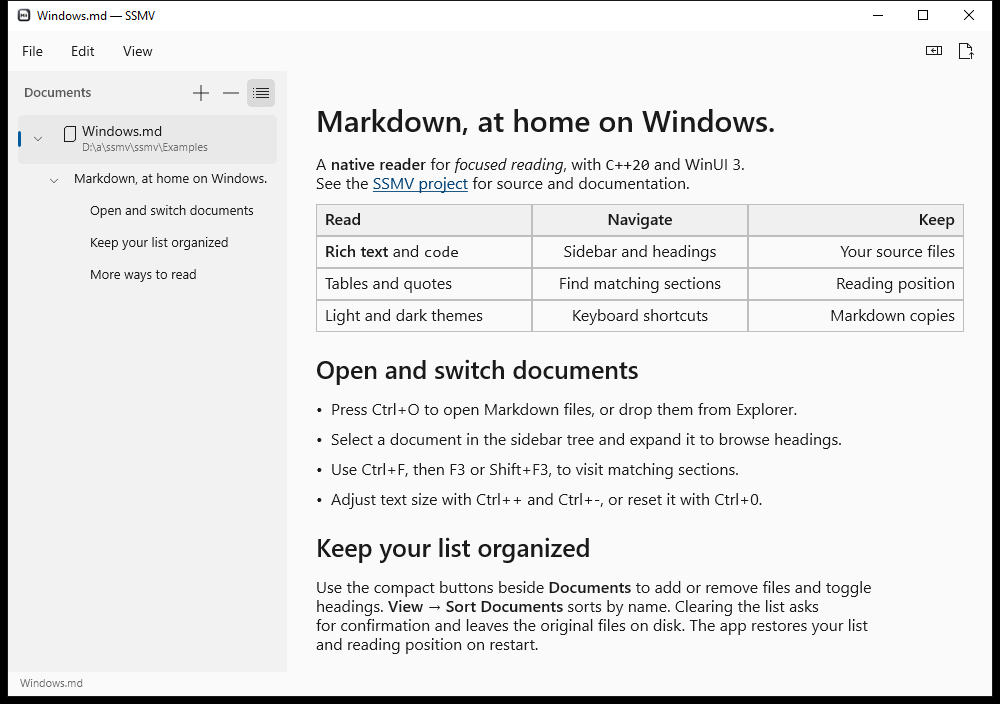

# Windows용 SSMV

[English](README.md) · [프로젝트 소개](../docs/README.ko.md)

C++20, C++/WinRT, WinUI 3로 개발 중인 Windows 버전입니다. 아직 정식 배포판이
아니며 macOS 버전의 모든 기능을 제공하지는 않습니다. 문서는 Windows 기본
텍스트 컨트롤로 표시합니다.



`6c0d9c3`의 x64 화면입니다. [다크 모드](../docs/images/ssmv-windows-native-ui-dark.png) ·
[메뉴 단축키](../docs/images/ssmv-windows-native-ui-menu.png)

## 빌드

Windows에 Visual Studio 2022의 **C++를 사용한 데스크톱 개발**과 Windows SDK
10.0.19041 이상을 설치하세요. ARM64 빌드에는 해당 C++ 빌드 도구도 필요합니다.
Windows App SDK의 WinUI 구성 요소와 C++/WinRT는 지정된 버전을 NuGet으로
받습니다. 사용하지 않는 AI·ML 구성 요소는 포함하지 않습니다.

```powershell
./windows/scripts/build.ps1
./windows/scripts/build.ps1 -Platform ARM64
```

Visual Studio에서 `SSMV.vcxproj`를 열어도 됩니다. 결과는 저장소 루트의
`dist/windows/<아키텍처>/Release/`에 생성됩니다. 실행 파일 하나만 옮기지 말고
폴더 전체를 함께 보관하세요. 해당 아키텍처의 Microsoft Visual C++ 재배포
패키지가 필요합니다. 앱 서명과 설치 프로그램은 아직 준비되지 않았습니다.

## 문서 읽기 기능

아래 기능을 구현했습니다. 남은 작업과 검증 범위는
[기능 동등성 점검표](../docs/WINDOWS-PARITY.ko.md)에 정리했습니다.

창 상단의 **File**, **Edit**, **View** 메뉴에 명령과 단축키를 함께 표시합니다.
테마는 **View → Appearance**에서 System, Light, Dark 중 선택합니다.
사이드바는 문서 아이콘과 하위 제목을 표시하는 Windows 기본 트리 컨트롤을 사용합니다.
**Documents** 오른쪽에는 추가·제거·목차 아이콘을 모았습니다. 아이콘에 마우스를
올리면 기능과 단축키가 표시됩니다. 제거 버튼을 우클릭하면 **Remove All Documents…**를
선택할 수 있습니다.

- 목차나 문서 내부 링크로 이동하면 해당 구간을 잠깐 강조해 위치를 알려줍니다.
- 파일 선택, 실행 인수, 드롭으로 `.md`, `.markdown`, `.mdown` 문서를 엽니다.
  실행 중인 앱에는 절대 경로를 전달합니다. 상대 경로 인수는 앱을 처음 실행할
  때만 지원하며, 기존 앱으로 전달할 때는 거부합니다.
- 접을 수 있는 사이드바에서 문서를 전환하고 목차 탐색, 이름순 정렬, 개별 제거를
  지원합니다. 전체 제거에는 확인이 필요하며 원본 파일은 삭제하지 않습니다.
- 기본 텍스트 컨트롤로 제목, 목록, 인용, 코드, 강조, 취소선, 링크, 정렬된 표를
  표시합니다. Markdown 전체 명세를 지원하는 것은 아닙니다.
- Ctrl+F로 찾기를 열고 F3·Shift+F3으로 일치하는 **구간**을 이동합니다.
  개별 단어를 강조하거나 출현 횟수를 세지는 않습니다. 큰 표 안의 결과는 표의
  별도 페이지 버튼으로 찾아야 할 수 있습니다.
- Ctrl++·Ctrl+-로 글자 크기를 바꾸고 Ctrl+0으로 초기화합니다. 텍스트 선택은
  블록 단위이며 **Edit → Copy Document Text**로 문서 전체의 일반 텍스트를 복사합니다.
- Ctrl+R로 새로 고치고 Ctrl+Shift+S로 원본 형식 그대로 복사본을 저장합니다.
  탐색기에서 파일 위치를 표시하고 F11로 전체 화면을 전환할 수 있습니다.
- **File → Open from Clipboard**에서 클립보드 Markdown을 가져옵니다. 재시작하면 목록, 선택 문서,
  읽던 위치, 펼친 목차, 글자 크기, 테마를 복원합니다.

macOS에서 Command를 쓰는 일반 명령은 Windows에서 Ctrl을 사용합니다.
전체 단축키는 메뉴에 표시하며 자주 쓰는 명령은 다음과 같습니다.

| 기능 | 단축키 |
| --- | --- |
| 파일 열기 | Ctrl+O |
| Markdown URL 열기 | Ctrl+L |
| PDF 내보내기 | Ctrl+P |
| 클립보드 Markdown 열기 | Ctrl+Shift+V |
| 찾기 | Ctrl+F |
| 복사본 저장 | Ctrl+Shift+S |
| 전체 화면 | F11 |

## URL 문서와 PDF 저장

**File → Open URL…**(Ctrl+L)에 원본 HTTPS Markdown 주소나 GitHub의 `blob`
파일 주소를 입력합니다. UTF-8 문서는 16 MiB까지 받으며 HTTPS 리디렉션은
최대 5회로 제한합니다. 네트워크 제한 시간을 두고, 인증 정보가 포함된 주소와
HTML 응답은 거부합니다. 저장된 문서는 오프라인에서도 다시 열 수 있습니다.
**Reload**는 원격 원본을 새로 받습니다. 상대 링크는 캐시 폴더가 아닌 원격
주소를 기준으로 해석합니다. 캐시는 `%LOCALAPPDATA%\SSMV\remotes`에
256 MiB까지 보관하며 목록에서 제거해도 파일은 남습니다.

**File → Export PDF…**(Ctrl+P)에서 선택한 문서 전체를 저장합니다. 화면에
보이지 않는 구간도 포함하며 저장 창을 열기 전에 내용을 고정합니다.
**File → Cancel Current Operation**으로 다운로드나 내보내기를 취소합니다.
PDF 내보내기를 취소해도 기존 대상 파일은 유지합니다.

PDF 저장에는 Windows 기능의 **Microsoft Print to PDF**가 필요합니다.
밝은 배경에 유니코드 텍스트, 제목, 목록, 코드, 표를 페이지로 나눠 저장합니다.
웹·이메일 주소는 텍스트로 남기지만 클릭 가능한 PDF 링크와 인라인 강조는
보존하지 않습니다. 읽기 어려울 만큼 열이 많은 표는 오류를 안내합니다.
PDF 서식은 아직 macOS와 동일하지 않습니다.

UTF-8 입력은 16 MiB로 제한합니다. 클립보드 문서는
`%LOCALAPPDATA%\SSMV\imports`에 보관하며 합계 256 MiB까지 받습니다.
목록에서 제거해도 저장 파일은 남습니다. 보관 문서를 관리하는 앱 내 기능은
아직 없습니다. 가져온 텍스트에서는 로컬 파일 링크를 열지 않습니다. 복사본을
저장하면 그 폴더를 기준으로 상대 링크를 열 수 있습니다. 세션 상태는 같은 앱
저장소에 보관합니다. 복구에 실패하면 오류를
알리고 자동 저장을 중지해 기존 상태 파일을 보호합니다.

본문은 2,000개 블록, 목차는 200개 제목씩 표시합니다. 표는 본문 100행·12열씩
표시하며 나머지 내용은 페이지 버튼으로 이동합니다. 분석한 문서 데이터는 메모리에
남습니다. 이 제한이 대용량 문서의 성능을 보장하지는 않으며 연속 스크롤 최적화는
후속 작업입니다.

원격 URL을 인수로 받는 CLI, 표준 입력·제목을 받는 CLI, 가져온 문서 관리,
추가·수정 순서 정렬, 설치 시 파일 연결, 업데이트 안내, 도움말·About은 남아 있습니다.
일반 웹 링크는 기본 브라우저로 엽니다.
두 플랫폼 모두 삽입 이미지의 픽셀을 내려받아 표시하거나 Markdown을 편집하지는
않습니다. Windows 전체 화면은 현재 앱 내부 컨트롤을 유지하며 macOS처럼 마우스를
올렸을 때 상단을 다시 표시하는 동작은 후속 작업입니다.

## 검증

```sh
cmake -S windows -B windows/.build/core
cmake --build windows/.build/core --config Release
ctest --test-dir windows/.build/core -C Release --output-on-failure
```

`6c0d9c3`에서 문서·Markdown·세션 테스트 3개 모음과 x64·ARM64 빌드,
[x64 자동 실행 검증](https://github.com/raeseoklee/ssmv/actions/runs/35187903182)을 통과했습니다.
앱 실행 직후 View 메뉴 열기, 펼친 트리의 순서, 같은 제목으로 반복 이동,
Ctrl+F 검색 결과 있음·없음, 글자 크기 확대·축소, 사이드바·목차 전환,
다크 모드 선택을 확인했습니다. 두 문서를 처음 열고 실행 중인 앱으로 전달한 뒤,
재시작 시 선택 문서와 설정을 복원하는 동작도 확인했습니다. 라이트·다크 모드와
메뉴 캡처도 눈으로 검토했습니다. ARM64에서의 실제 실행은 아직 검증하지 않았습니다.

배포 전에는 Windows에서 파일 선택 취소, 탐색기·바탕화면 드롭, 한글 경로,
키보드 조작, 표, 테마, 화면 배율, 내레이터와 대용량 문서 응답성을 확인해야 합니다.
이번 작업으로 새 버전을 배포하거나 Homebrew를 변경하지 않습니다.
