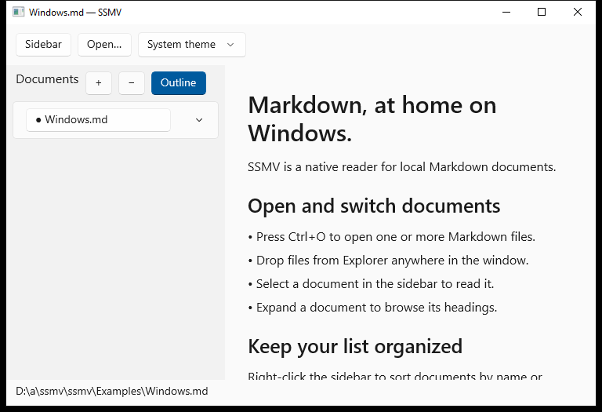

# SSMV for Windows

[한국어](README.ko.md) · [Project overview](../README.md)

The Windows port uses C++20, C++/WinRT and WinUI 3. It is a development build,
not a published release or a replacement for the macOS app. It uses native text
controls; there is no embedded browser or background server.



Screenshot from the previous native x64 build; it does not yet show this reading increment.

## Build

On Windows, install Visual Studio 2022 with **Desktop development with C++**,
the Windows SDK (10.0.19041 or newer), and C++ ARM64 build tools if targeting ARM64.
NuGet restores the pinned Windows App SDK WinUI component and C++/WinRT packages.
The project references the UI component directly to avoid unused AI/ML components.

```powershell
./windows/scripts/build.ps1
./windows/scripts/build.ps1 -Platform ARM64
```

You can also open `SSMV.vcxproj` in Visual Studio. Output goes to
`dist/windows/<architecture>/Release/` at the repository root. Keep that entire
folder together: this is an unpackaged, self-contained Windows App SDK app, not
a standalone executable. The matching Microsoft Visual C++ Redistributable is
required. Builds are unsigned; installation and signing are not configured yet.

## Reading features

The current source adds these features; native Windows validation of this increment
is pending. See the [parity checklist](../docs/WINDOWS-PARITY.md) for remaining work.

- Open local `.md`, `.markdown` and `.mdown` files through a picker, arguments or
  drops. Forward absolute file paths to the running app. Relative arguments work
  on a cold launch but are rejected when forwarding to an existing instance.
- Switch documents in a collapsible sidebar, browse headings, sort by name and
  remove entries. Clearing the list requires confirmation and never deletes sources.
- Read headings, lists, quotes, code, emphasis, strikethrough, links and aligned
  tables with native text controls. This remains a Markdown subset.
- Find matching **sections** with Ctrl+F and F3/Shift+F3. Search navigates between
  blocks; it does not highlight or count individual occurrences. Large tables may
  require their own page controls after navigating to the table.
- Change text size with Ctrl++/Ctrl+- and reset with Ctrl+0. Selection is per block;
  **More → Copy Document Text** copies the full document's plain text.
- Reload with Ctrl+R, save the original Markdown bytes with Ctrl+Shift+S, reveal
  a file in Explorer and enter/leave full screen with F11.
- Import clipboard Markdown from **More**, and restore the shelf, selected document,
  reading position, expanded outlines, text size and appearance on restart.

UTF-8 input is limited to 16 MiB. Clipboard imports are stored under
`%LOCALAPPDATA%\SSMV\imports` with a 256 MiB total limit. Removing them from the
sidebar preserves those files; an in-app retained-import manager is not yet available.
Session data is stored alongside them. If session recovery fails, the app reports
an error and disables automatic session writes to protect the existing state.

The body displays at most 2,000 blocks per part; outlines show 200 headings per
part. Tables display 100 body rows and 12 columns at a time, with navigation for
the remainder. Parsed documents remain in memory. These bounds do not establish
large-document performance parity; continuous viewport virtualization is pending.

PDF export, remote Markdown URLs, stdin/title CLI delivery, imported-document
management, added/modified sorting, installer file associations, update guidance
and Help/About remain incomplete. Web hyperlinks open in the default browser;
that is different from loading remote Markdown into SSMV. Neither platform fetches
embedded image pixels or provides Markdown editing. Windows full screen currently
retains its in-app controls; matching macOS hover-reveal behavior remains work.

## Tests

The parser and document library have no Windows UI dependencies. Run their tests
on macOS, Windows or Linux:

```sh
cmake -S windows -B windows/.build/core
cmake --build windows/.build/core --config Release
ctest --test-dir windows/.build/core -C Release --output-on-failure
```

Three portable suites (documents, Markdown and session persistence) pass for this
increment. The workflow builds x64 and ARM64 and is intended to exercise activation,
restart recovery and screenshots on x64; **those native checks are pending for this
change**. ARM64 runtime behavior must be checked separately.

Before release, validate picker cancellation, Explorer/desktop drops, Korean paths,
keyboard navigation, tables, theme changes, display scaling, Narrator and large-file
responsiveness on Windows. This work does not create a release or change Homebrew.

## Layout

- `App/`: WinUI application and native document UI.
- `Core/`: portable parser and document library.
- `Tests/`: core regression tests.
- `scripts/build.ps1`: Windows build entry point.

The Windows and macOS apps share project documentation and example documents,
not platform UI code. See [Microsoft's deployment documentation](https://learn.microsoft.com/en-us/windows/apps/package-and-deploy/unpackage-winui-app)
for the unpackaged deployment model.
